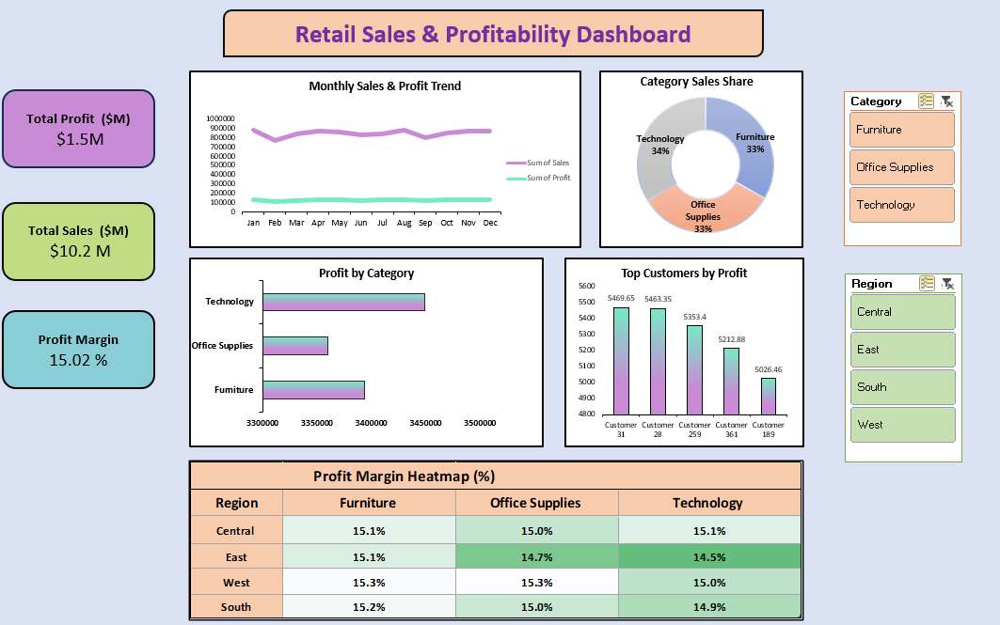

#	Retail Sales & Profitability Dashboard (Excel)

   

This project is an Excel-based analysis of retail sales data, focused on understanding sales performance, profitability, and customer contribution across regions and product categories. The goal was to build an interactive dashboard that could realistically be used by business stakeholders to monitor performance and identify improvement areas.

The work covers the full process, starting from raw data preparation to creating a clean, presentable dashboard.

1.	Problem Statement

Retail teams often struggle to quickly answer questions like:
How are sales and profits performing across regions?
Which product categories are more profitable?
Are there any noticeable trends in sales over time?
Which customers contribute the most to overall profit?

This dashboard was created to bring all of this information into a single, easy-to-use view.

2.	Dataset Description

The dataset contains approximately 10,000 retail transaction records.  
It includes order dates, regions, product categories, customer names, sales values, and profit values.

Before analysis, the data was cleaned and structured using Power Query to ensure consistency and usability.

3.	Tools and Approach

The analysis was performed entirely in Microsoft Excel.

Power Query was used for data cleaning and transformation. Pivot tables and pivot charts were used to summarize sales and profit across different dimensions. Key performance indicators such as total sales, total profit, and profit margin were calculated to support business-level insights.

Interactive slicers were added to allow filtering by region and category. Conditional formatting was used to create a profit margin heatmap, making margin differences easy to spot.

4.	Dashboard Overview

The dashboard provides:
•	High-level KPIs for sales, profit, and profit margin
•	A monthly trend view of sales and profit
•	Category-wise sales contribution
•	Profit comparison across product categories
•	Top customers ranked by profit contribution
•	A region-by-category profit margin heatmap
•	Interactive filtering using slicers

The layout is designed to fit on a single page and support quick decision-making.

5.	Key Observations

Sales are relatively evenly distributed across product categories, indicating a diversified revenue base.  
Profit margins, however, vary noticeably across regions and categories, highlighting areas where pricing or cost structures may differ.  
The Technology category shows consistently strong profitability.  
A small group of customers accounts for a significant share of total profit, suggesting the importance of customer retention.

6.	Recommendations

Business efforts could be focused more strongly on high-margin categories and regions.  
Low-margin segments may benefit from a review of pricing, discounts, or cost controls.  
Given the concentration of profit among top customers, targeted retention or loyalty strategies could help protect revenue.

7.	What This Project Shows

This project demonstrates practical Excel skills applied to a realistic business scenario.  
It shows the ability to clean data, analyze performance metrics, and present insights through a clear, interactive dashboard that is suitable for stakeholders.
